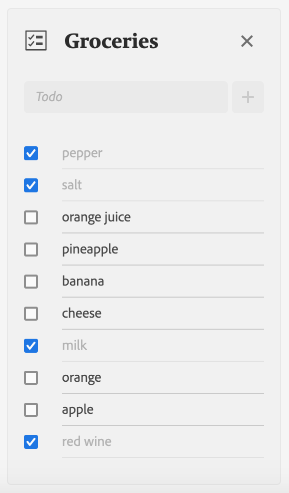

## Lesson 5: Setup the TodoList component

In this lesson, we'll create a TodoList React component that will be able to: 

* Create a new Todo item.
* Delete the whole todo list. 
* Display Todo items we have built in the previous lesson.  

We'll create the React component file under `web-src/src` and name it `TodoList.js`.

### Import React Spectrum components

This component will make use of several React Spectrum components: 

* [View](https://react-spectrum.adobe.com/react-spectrum/View.html) a generic container.
* [Well](https://react-spectrum.adobe.com/react-spectrum/Well.html) a generic pre-styled container which will contain the todo list.
* [Flex](https://react-spectrum.adobe.com/react-spectrum/Flex.html) for the layout.
* [Form](https://react-spectrum.adobe.com/react-spectrum/Form.html) to submit the todo.
* [TextField](https://react-spectrum.adobe.com/react-spectrum/TextField.html) the input field for the todo value.
* [ActionButton](https://react-spectrum.adobe.com/react-spectrum/ActionButton.html) to trigger form submission.
* [AlertDialog](https://react-spectrum.adobe.com/react-spectrum/AlertDialog.html) to warn the user before deleting a todo list.
* [DialogTrigger](https://react-spectrum.adobe.com/react-spectrum/DialogTrigger.html) to open the AlertDialog.

```javascript
import { View, Flex, Form, TextField, ActionButton, AlertDialog, DialogTrigger, Well } from '@adobe/react-spectrum';
``` 

### Component properties

The component will accept 3 properties:

* `todoList` which corresponds to the todo list object which holds the todo list name and todo items.  
* `onDelete` the callback function to delete a todo list.
* `onUpdate` the callback function to update a todo list.

```javascript
function TodoList({ todoList, onDelete, onUpdate }) {
  const { name, todos } = todoList;
  // ...
}
```

### Spectrum Icons

We'll add [React Spectrum Workflow Icons](https://react-spectrum.adobe.com/react-spectrum/workflow-icons.html) to the `TodoList` component. The icons are simply SVGs packed as React components.  
To import icons, you have to install the `@spectrum-icons/workflow` dependency. It's pre-installed if you initialize the Firefly app with the React Spectrum template.

Each icon has to be imported individually with a single statement.

```javascript
import TaskList from '@spectrum-icons/workflow/TaskList';
import Close from '@spectrum-icons/workflow/Close';
import Add from '@spectrum-icons/workflow/Add';
```

A [searchable list of workflow icons](https://spectrum.adobe.com/page/icons/) is available on the Spectrum website. The name of the icon without any whitespace matches the import in React Spectrum.  

### Displaying the todo list name

React Spectrum has made available a set of components and keeps delivering new components with every release. Unfortunately, some components are not available yet in React Spectrum but available in [Spectrum CSS](https://opensource.adobe.com/spectrum-css/) which is the CSS framework used by React Spectrum to style components. 
Luckily for us, we can use React Spectrum together with Spectrum CSS to fill the gap of missing components.

In this case, we're going to install the [Spectrum CSS Typography](https://opensource.adobe.com/spectrum-css/typography.html) dependency to render Spectrum headings.
Since React Spectrum already defines the Spectrum CSS variables, you'll only need to install the Spectrum CSS Typography package.

```bash
npm i --save @spectrum-css/typography
``` 

Then you can simply import the CSS with:

```javascript
import '@spectrum-css/typography';
``` 

Now you can use the Spectrum CSS Heading classes to render the todo list name.

```jsx
<h2 className="spectrum-Heading spectrum-Heading--sizeM spectrum-Heading--serif">{name}</h2>
```

### Rendering todo items

Once again, we're going to use the [State hook](https://reactjs.org/docs/hooks-state.html) `useState` to declare a state variable which will hold a list of todo items.
This list will be updated whenever a new todo item is created. By default, it's initialized with the `todos` from the `todoList` prop. 

```javascript
const [todoItems, setTodoItems] = useState(todos);
```

Next we'll iterate over the `todoItems` array using the [map()](https://developer.mozilla.org/en-US/docs/Web/JavaScript/Reference/Global_Objects/Array/map) function to render each item as `Todo` component.

```jsx
<View marginTop="size-100">
  {todoItems.map((todo) => (
    <Todo key={todo.id} name={name} todo={todo} onUpdate={onUpdate} />
  ))}
</View>
```

The `key` property is necessary in React to uniquely identify the todo item. In this case, we use the todo id. 
You can read more about React lists and keys [here](https://reactjs.org/docs/lists-and-keys.html).

We're also passing the `name`, `todo` and `onUpdate` props down to the `Todo` component.      

### Creating a todo item

If you remember in [lesson 2](lesson2.md), we defined a `MAX_TODO_ITEMS` value within a global configuration file `defaults.json` at the root of the Firefly App.

We'll use it to block the user from creating too many todo items inside a todo list. We can import the value similarly to what we have done in the Runtime action.

```javascript
import { MAX_TODO_ITEMS } from '../../defaults.json';
``` 

Then we're going to use the [React hook](https://reactjs.org/docs/hooks-intro.html) `useState` again to bind it to the TextField to create a new todo item similarly to the previous lesson. 

```javascript
const [newTodo, setNewTodo] = useState('');
```

This time we're going to disable the input once we reach the count of `MAX_TODO_ITEMS` by setting the `isDisabled` prop.

```jsx
<TextField
  autoComplete="off"
  isDisabled={todoItems.length >= MAX_TODO_ITEMS}
  aria-label="New todo"
  width="100%"
  value={newTodo}
  onChange={(value) => {
    setNewTodo(value);
  }}
  placeholder="Todo"
  minLength={1}
  maxLength={140}
/>
<ActionButton type="submit" isDisabled={todoItems.length >= MAX_TODO_ITEMS}>
  <Add />
</ActionButton>
```

Finally, we'll wrap the `TextField` and the submit `ActionButton` with a `Form` component so that we can invoke the `onUpdate` callback function on form submission. 
We'll prevent the default form submission behavior with `event.preventDefault()` and create a new todo item object that we pass to the callback function.
Additionally, we're clearing the value of `TextField`.  

```jsx
<Form
  onSubmit={async (event) => {
    event.preventDefault();

    const index = todoItems.length;
    const newTodoItem = { name, id: index, value: newTodo, done: false };
    setTodoItems([newTodoItem, ...todoItems]);
    setNewTodo('');

    onUpdate && (await onUpdate(name, newTodoItem));
  }}>
```  

### Deleting a todo list

Next to the todo list name, we'll add a trigger to delete the list. The trigger will open an `AlertDialog` to warn the user about the destructive action.
Confirming the operation will simply call the `onDelete` callback function passing it the `name` of the todo list. The dialog will close itself automatically.  

```jsx
<DialogTrigger>
    <ActionButton isQuiet>
      <Close />
    </ActionButton>
    <AlertDialog
      title="Clear todo list"
      variant="destructive"
      primaryActionLabel="Delete"
      secondaryActionLabel="Cancel"
      onPrimaryAction={async () => {
        onDelete && (await onDelete(name));
      }}>
      This action will clear the todo list <strong>{name}</strong>. Are you sure you want to continue ?
    </AlertDialog>
</DialogTrigger>
```

### Full component

Finally, we'll wrap the whole component inside a `Well` and use the Flex layout to verticall align the `Todo` items.

See the full component code [here](https://github.com/AdobeDocs/adobeio-samples-todoapp/blob/master/web-src/src/TodoList.js).



[Next](lesson6.md)     


